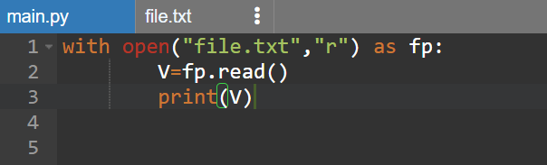
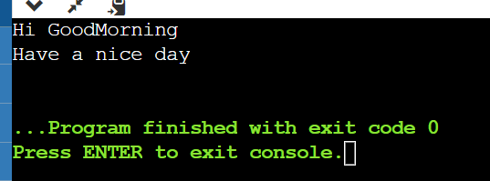

# copy-file
## AIM:
To write a python program for copying the contents from one file to another file.
## EQUIPEMENT'S REQUIRED: 
PC
Anaconda - Python 3.7
## ALGORITHM: 
### Step 1:First we need to open the required file from which we need to copy test.
### Step 2:Using keyword "with" to open the required file.
### Step 3:Again using the with keyword to open the empty file.
### step 4:The empty file is open by using "w" which is used to wire only.
### step 5:The for function is used to take each line from the main file.
### step 6:Write() is used to write the linesof main file to the empty file or do the directed file.

## PROGRAM:
with open("file.txt","r") as fp:
        V=fp.read()
        print(V)

### OUTPUT:

## RESULT:
Thus the program is written to copy the contents from one file to another file.